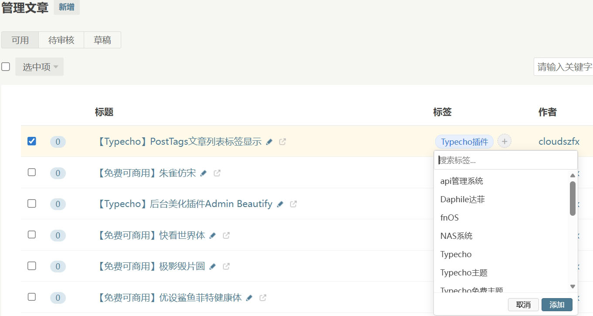
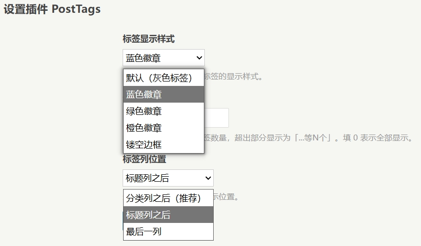

# PostTags-Typecho-Plugin
Typecho后台文章列表：标签显示 + 快速添加标签插件

适配Typecho 1.3.0 + PHP 8.4

在后台文章管理列表页新增「标签」列，直观展示每篇文章的标签。

通过下拉选框快速为文章添加已有标签。

插件设置里有标签显示样式、最大显示标签数和标签列位置设置

本插件由AI大模型： [智谱清言][1] 编写

  [1]:https://chatglm.cn/
